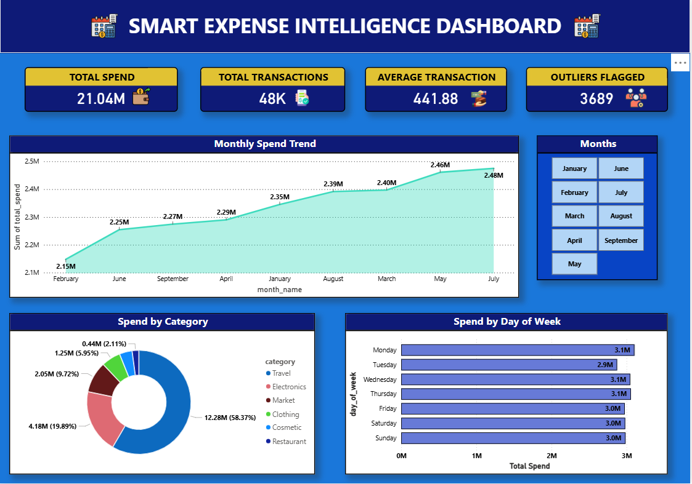
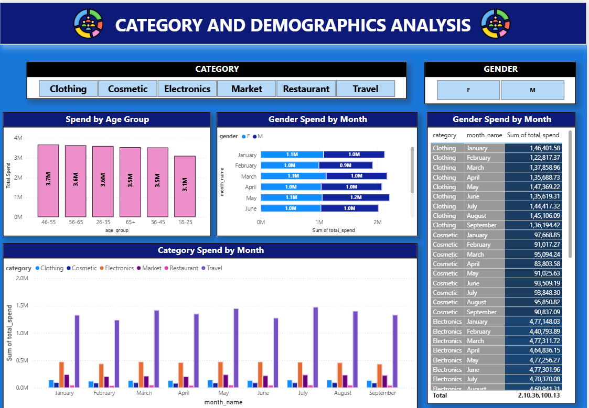
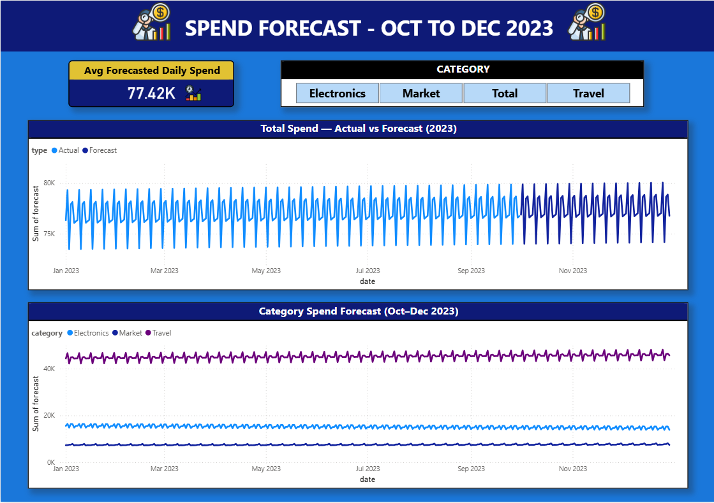

# 💰 Smart Expense Intelligence Dashboard

> End-to-end data analytics project — Python • SQL • Prophet • Power BI

---

## 📌 Project Overview

A full-stack data analytics project that analyses 50,000+ credit card transactions 
across 6 spending categories. Covers the complete data analyst workflow — from raw 
data ingestion and cleaning to SQL analysis, time-series forecasting, and interactive 
Power BI dashboards.

---

## 🎯 Key Business Insights

| # | Insight |
|---|---------|
| 1 | Travel dominates spend at **58.4% (₹12.9M)** of total ₹22.1M — driven by high ticket size, not frequency |
| 2 | All **3,873 high-value transactions (>₹1,645)** belong exclusively to Travel |
| 3 | Restaurant has the **most transactions (8,413)** but lowest spend — avg ticket only ₹55 |
| 4 | Category ranking is **100% consistent every month** — no seasonal shifts observed |
| 5 | **46-55 age group** spends the most (₹3.85M) — consistent avg ticket across all ages |
| 6 | Female spend (₹10.12M) edges Male (₹9.79M) — **frequency-driven, not ticket size** |
| 7 | Spend alternates up-down monthly — **March, May, July** are peak growth months |
| 8 | Prophet forecast predicts **stable ₹77K/day** spend through Dec 2023 |

---

## 🛠️ Tech Stack

| Layer | Tools |
|-------|-------|
| Data Cleaning | Python, Pandas, NumPy |
| Database | MySQL, SQLAlchemy |
| Analysis | SQL (CTEs, Window Functions, LAG, RANK) |
| Visualisation | Matplotlib, Seaborn |
| Forecasting | Facebook Prophet |
| Dashboard | Power BI, DAX |
| Version Control | Git, GitHub |

---

## 📁 Project Structure

expense-dashboard/
│
├── data/
│   └── clean_transactions.csv    ← cleaned dataset (50K rows, 18 cols)
│
├── notebooks/
│   ├── 01_data_cleaning.ipynb    ← ETL pipeline
│   ├── 02_eda.ipynb              ← 8 charts, 8 insights
│   ├── 03_sql_analysis.ipynb     ← 8 advanced SQL queries
│   └── 04_forecasting.ipynb      ← Prophet time-series models
│
├── sql/
│   └── queries.sql               ← all 8 SQL queries
│
├── exports/                      ← Power BI data sources
│   ├── transactions_clean.csv
│   ├── monthly_summary.csv
│   ├── category_monthly.csv
│   ├── gender_monthly.csv
│   └── forecasts.csv
│
├── screenshots/                  ← dashboard & chart images
├── requirements.txt
└── README.md


---

## 📊 Dashboard Pages

### Page 1 — Executive Overview


### Page 2 — Category & Demographics


### Page 3 — Forecast


---

## 🔍 SQL Highlights

```sql
-- Month-over-Month spend change using LAG
WITH monthly_spend AS (
    SELECT month, month_name,
        ROUND(SUM(transaction_amount), 2) AS total_spend
    FROM transactions
    WHERE month < 10
    GROUP BY month, month_name
)
SELECT month_name, total_spend,
    LAG(total_spend) OVER (ORDER BY month) AS prev_month,
    ROUND((total_spend - LAG(total_spend) OVER (ORDER BY month))
          * 100.0 / LAG(total_spend) OVER (ORDER BY month), 2) AS mom_pct_change
FROM monthly_spend;
```

---

## 📈 Forecasting

- Trained **Facebook Prophet** on 273 daily data points
- Forecasted **90 days ahead** (Oct–Dec 2023) for total spend + 3 categories
- Weekly seasonality detected — Monday peak spending pattern confirmed
- Confidence interval: **95%**

---

## 🚀 How to Run

```bash
# Clone the repo
git clone https://github.com/YOUR_USERNAME/expense-intelligence-dashboard.git
cd expense-intelligence-dashboard

# Create virtual environment
python -m venv venv
venv\Scripts\activate

# Install dependencies
pip install -r requirements.txt

# Run notebooks in order
# 01_data_cleaning → 02_eda → 03_sql_analysis → 04_forecasting
```

**Requirements:**
- Python 3.10+
- MySQL Server running locally
- Power BI Desktop (for dashboard)

---

## 👤 Author

**Harshal Nanasaheb Kawane**  
📧 harshalkawane3@gmail.com  
🔗 [GitHub](https://github.com/h4rshalk/Smart-Expense-Intelligence-Dashboard)  
📍 Pune, Maharashtra